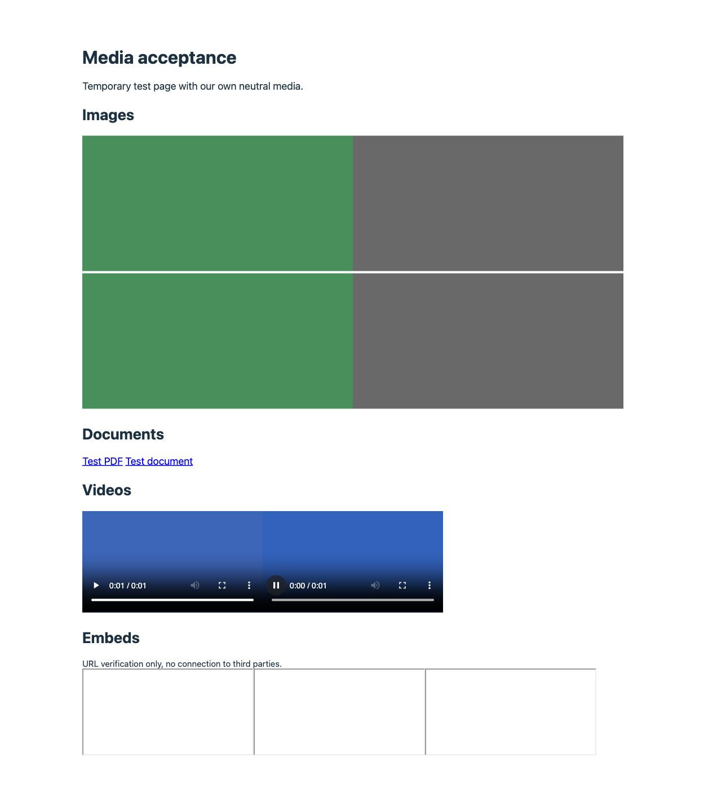

# Media replacement acceptance — 2026-09-28

## Result and scope

The production Deepglot dashboard/API and a publicly reachable, independent
WordPress test installation completed the mapping → authenticated runtime
refresh → anonymous translated HTML → actual asset chain for issue #317.
This is public WordPress **staging acceptance**, not a claim that customer
production installations were upgraded automatically.

- SaaS: deepglot.ai, production merge `7a68ea36ce444f7d19af48e408246799cc09652e`, PR #361.
- WordPress: juvenisstage.wpengine.com, WordPress 7.0.5, PHP 8.2.33, existing SSH access and existing valid project connection. Deepglot 0.12.6 was backed up, temporarily replaced with the 0.12.10 repository artifact, and restored byte for byte afterwards.
- The Stage already used the juvenismed.at project connection. Only disposable, previously absent upload paths and synthetic provider IDs were mapped in that project; no existing media mapping was edited.
- hddental was excluded because its independent incident investigation still lacked an established origin-timeout cause.
- Own neutral files and a clearly labeled noindex page were created. The page used seeded translations and a page-scoped HTTP guard. The final guard counter was **0**: fixture renders/editor annotation needed no translation or URL-sync requests. The actual template omitted WordPress head/footer hooks and all four captured documents contain only the JSON-LD script, so no analytics tracker or bridge script loaded in this run. The reusable HTTP guard also covers the bridge-specific `urlPath` payload, as checked by regression tests. Existing keys were reused without export, replacement, or creation.

## Observed results

| Criterion | Evidence |
| --- | --- |
| Manager workflow | Eight mappings created in the production dashboard, one image replacement edited, all eight deleted; original and final lists both empty. PR #361 covers unauthorized users, other tenants, inactive languages, recovery and concurrent edits. |
| Images | Anonymous EN replaced root-relative and absolute `src`, width/density `srcset`, typed picture sources, `data-src`, `data-srcset`; dimensions and descriptors preserved. An unmapped candidate and an unmapped image retained their source URLs. DE remained unchanged. |
| Documents | Real PDF and DOCX links changed to matching EN formats, retained download attributes, and returned HTTP 200 with expected MIME and exact fixture bytes. XLSX/PPTX format classification is covered by API validation tests; this live run used PDF/DOCX. |
| Videos | MP4 `video[src]` and WebM `source[src|data-src]` changed. Both actual files decoded in anonymous Chrome: 320×180, one second, readyState 4, no media error. |
| Embeds | YouTube, YouTube-nocookie and Vimeo exact provider URLs changed in `data-src`. Synthetic IDs and absent `src` kept all three frames at about:blank. No external provider was loaded or third-party playback claimed. |
| Asset routing | All 12 source, replacement, second-version and fallback files returned 200 with exact generated bytes. Upload paths never acquired `/en/`. |
| Cache behavior | The installed WP Engine page cache produced MISS then HIT. After editing and authenticated runtime refresh, HIT still returned the previous image, as documented for upstream caches. A purge restricted to the DE/EN fixture paths produced MISS and the changed image. The deletion path was also purged and read back. No inactive WP Rocket cache was asserted as live evidence. |
| Fallback/deletion | Following deletion and runtime refresh, anonymous EN restored the original image, documents, videos and embed URLs; translations remained intact. |
| Text/accessibility/SEO | DE/EN captures assert text, translated alt, title, description, noindex and valid translated JSON-LD; shared JSON-LD image identity stayed unchanged. |
| Visual editor | Installed WordPress `translateForEditor` produced nine segments; MediaRewriter then applied the second image replacement with zero provider requests. This is installed translator/rewriter evidence. Authenticated editor save, shell and authorization regressions remain separately proven by main CI; no customer editor save was performed. |
| Cleanup | Own page and media directory removed; DE/EN fixture URLs and deleted image returned 404, Stage home 200; SaaS mappings and plugin media option empty. The original plugin's 122 files compare byte for byte. All seeded fixture text cache entries removed, including four generic headings after checking their fixture values. This first run had no transient snapshot, so exact restoration of pre-test transient values/expiry is not claimed; persistent SaaS translations and source posts were not changed. The reproducible fixture uses distinct heading text and snapshots values/expiry before seeding; cleanup restores that snapshot. |

## Validation and evidence files

Targeted verification passed: **43 Node tests**, seven PHP regression files,
SwitcherVisualEditorTest.js, PHP syntax checks, documentation-language check,
and four independent assertions over the stored anonymous HTML.
Eleven fixture regression groups also passed after test-first review fixes: bridge
analytics isolation, cleanup with unrelated mappings, owned mapping detection,
visible DE/EN copy, page-insertion rollback, ownership-metadata rollback and
positive prefixed fixture copy, retry after failed page deletion, nested mapping
counts, skipped runtime refreshes and absolute media origin verification. These
tests exercise reusable helpers locally;
they do not claim a second live failure-injection run.

The exact prior main CI passed 743 unit, 48 PostgreSQL integration and 64 browser
tests plus all required build/type/lint/schema/WordPress/visual-editor gates:
[main run 36430996924](https://github.com/ostheimer/deepglot/actions/runs/36430996924).
The follow-up PR carries the documentation and reproducible evidence, without
changing the application or plugin runtime.

Stored captures are historical fixture output. The live fixture has been removed.
`runtime-*.json` contains only media maps, source/targets and fixture counters;
`asset-readback.json` records MIME, sizes and hashes; `cache-readback.json`
records actual response cache headers. No keys, tokens, customer media or
private backups are included.



## Reproduce captured assertions

From the repository root:

```sh
php scripts/fixtures/media-wordpress-assert.php docs/acceptance/media-wordpress-2026-09-28/mapped-de.html de de
php scripts/fixtures/media-wordpress-assert.php docs/acceptance/media-wordpress-2026-09-28/mapped-en-hit.html en en
php scripts/fixtures/media-wordpress-assert.php docs/acceptance/media-wordpress-2026-09-28/edited-en.html en en-v2
php scripts/fixtures/media-wordpress-assert.php docs/acceptance/media-wordpress-2026-09-28/deleted-en.html en de
```

For another approved test host, append its explicit HTTP(S) origin as the final
argument to the HTML verifier. The verifier checks absolute image and JSON-LD
identity URLs against that origin; the default is the recorded Stage origin.

## Reproduce on an approved WordPress test installation

Use an existing valid connection and back up the installed plugin before testing.
Confirm that this disposable slug, upload directory and synthetic provider IDs
are unused and that the project's original mappings are known. A Stage cloned
from production can share its project key; only unique fixture mappings are safe.
Do not run full settings POST synchronization against a shared production
project: media acceptance uses SettingsSync's authenticated runtime GET, which
preserves SaaS-owned configuration.

1. Generate files into a new local directory with `python3 scripts/fixtures/media-wordpress/generate.py <new-directory>` (uses existing ffmpeg). No third-party assets or paid generation are needed.
2. On the approved test installation, install the tested plugin artifact temporarily. Copy `scripts/fixtures/media-wordpress-acceptance.php` to `wp-content/mu-plugins/deepglot-media-acceptance.php`, and all PHP files (including `support.php`) from `scripts/fixtures/media-wordpress/` to `wp-content/mu-plugins/deepglot-media-acceptance/`. Copy generated assets to `wp-content/uploads/deepglot-media-acceptance-20260928/`.
3. Run `wp eval-file wp-content/mu-plugins/deepglot-media-acceptance/setup.php`. It refuses an existing fixture, snapshots translated transient values/expiry before seeding, and refuses a persistent object cache without a suitable cache snapshot strategy. Capture anonymous source/EN baselines while mappings are absent.
4. In Project → Translations → Media, map `de.png`, `de.pdf`, `de.docx`, `de.mp4`, `de.webm` to their EN counterparts under the fixture upload directory. For URL-only provider tests, map YouTube/YouTube-nocookie `/embed/DgMediaDE01` to `/embed/DgMediaEN01`, and Vimeo `/video/98765432101` to `/video/98765432102`. Do not add provider `src` attributes.
5. Run `wp eval-file wp-content/mu-plugins/deepglot-media-acceptance/sync.php`. A skipped runtime refresh fails for an operator retry. Capture and assert anonymous HTML; fetch only fixture assets and compare bytes/MIME. On this WP Engine installation, `purge.php` restricts its installed cache API purge to the fixture paths; other hosts need their actual cache procedure.
6. Edit only the image replacement to `en-v2.png`; refresh runtime and prove cached versus purged public output. Run `editor.php` for the installed editor annotation plus media rewrite check.
7. Delete only the fixture mappings in the dashboard; refresh runtime, purge fixture caches and assert EN fallback. Then run `cleanup.php` to restore the transient snapshot and remove the owned page. A failed page deletion retains the snapshot and fails so cleanup can be retried; unrelated media maps remain untouched and are counted individually. Remove the owned MU files and upload directory, restore the original plugin tree, and verify anonymous 404/home 200 and empty mappings.

## Product boundaries and #317 reconciliation

Security and ownership use the existing manager-only API, tenant isolation,
active-language requirements, protocol/origin/format allowlists, payload limits
and PHP runtime validation. Deepglot does not fetch or upload replacement files,
so it does not validate their binary content, availability, license or MIME on
behalf of the operator. This run verified the generated files independently.
Managers remain responsible for publication/redistribution rights and target
availability. Known plugin-cache invalidation and upstream operator purging
remain distinct. No new security scan was authorized or run.

Basic URL replacement has reproducible staging evidence plus production SaaS
and CI evidence. Public instructions accurately limit it to existing supported
URLs and plugin versions that implement the runtime. Customer installation,
external provider playback, dynamic AJAX media, and other host cache stacks are
separate acceptance actions. AI/OCR/subtitle/video generation is not implemented;
it requires a separate product decision, consent, budget, rights/privacy review
and dedicated tests before implementation. #257 remains unchanged.
